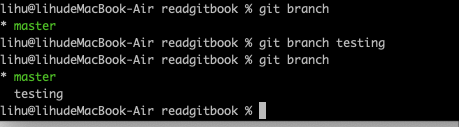
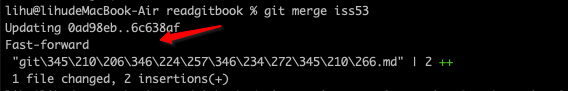
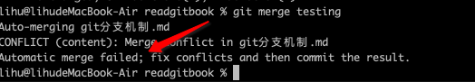
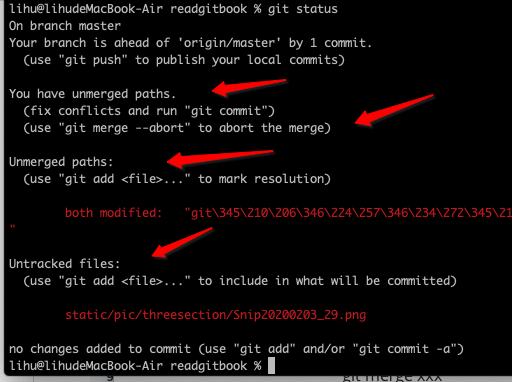
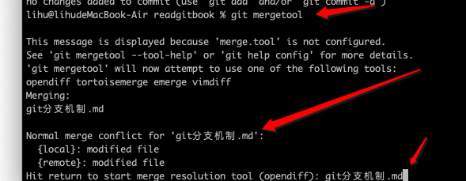
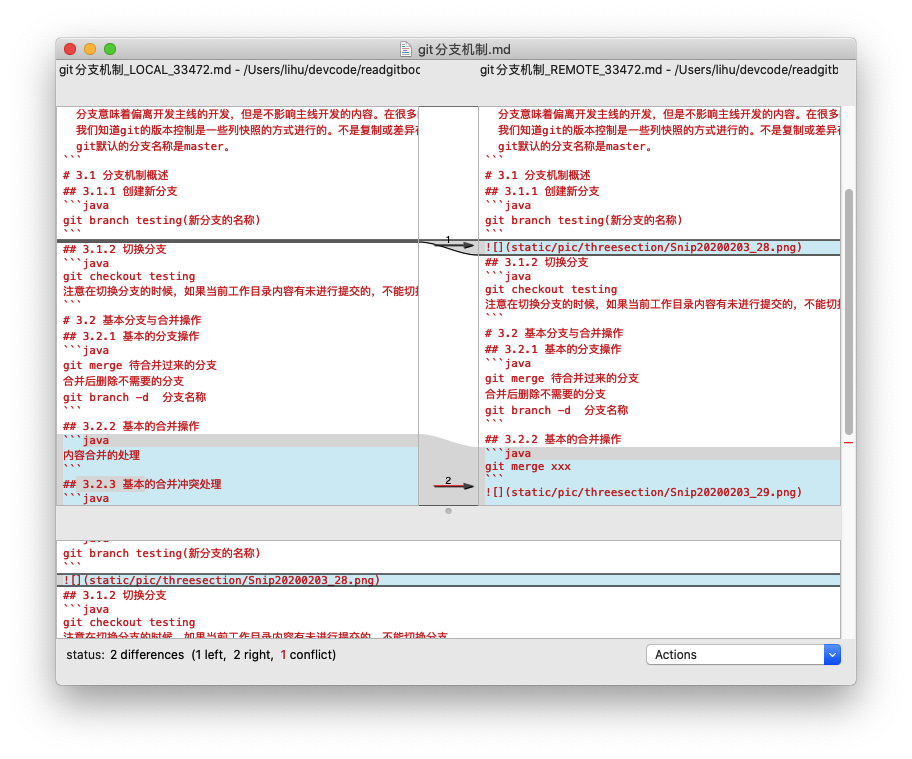
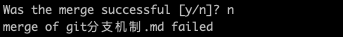
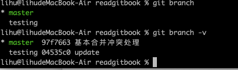
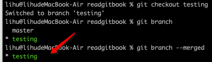
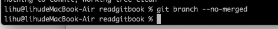

[toc]
```java
  分支意味着偏离开发主线的开发，但是不影响主线开发的内容。在很多的版本控制中，尤其对于一个大型项目来说，控制版本尤其重要。
  我们知道git的版本控制是一些列快照的方式进行的。不是复制或差异存储。
  git默认的分支名称是master。
```
# 3.1 分支机制概述
## 3.1.1 创建新分支
```java
git branch testing(新分支的名称)
```

## 3.1.2 切换分支
```java
git checkout testing
注意在切换分支的时候，如果当前工作目录内容有未进行提交的，不能切换分支
```
# 3.2 基本分支与合并操作
## 3.2.1 基本的分支操作
```java
git merge 待合并过来的分支
合并后删除不需要的分支 【本地删除】
git branch -d  分支名称
删除远程服务器上的分支
git push origin --delete 分支名称
```
## 3.2.2 基本的合并操作
```java
git merge xxx
```

## 3.2.3 基本的合并冲突处理
```java
现在有2个分支 testing、master
2个上面都有git分支机制的修改，都提交到暂存了。
现在在master合并testing分支的数据
git merge testing
会发生如下的情况
```






# 3.3 分支管理
```java
查看本地的所有的分支
git branch 
* 表示当前工作分区所在分支【HEAD指向的分支】
查看每个分支上的最新提交
git branch -v
```

```java
查看当前分支的所有已经合并过的分支
git branch --merged
查看当前分支所有未合并过的分支
git branch --no-merged
```



# 3.4 与分支有关的工作流（都是本地操作）
## 3.4.1 长期分支
```java
需要长期维护的分支，比如默认的master分支。
master分支只存放未定班的代码，即已经发布的版本或即将发布的版本的代码。
同时会维护develop或next的平行分支（此类分支不会保证稳定，但是一旦未定后，合并到master分支后，就可以删除此分支）进行开发，只到分支稳定测试后，进行代码的合并到master分支。
```
## 3.4.2 主题分支
```java
和长期分支不同的是，主题分支（topic branch）用于进行短期的，用于实现某一特定功能以及相关工作的分支。比如之前的testing或iss53分支。针对主题分支修改完善稳定后就可以进行删除。
```
# 3.5 远程分支
```java
远程分支是指直线远程仓库的分支的指针。这些指针存在于本地切无法被移动。当你与服务器进行任何网络通信时候，他们会自动更新。远程分支有点像书签，他们会提示你上一次链接服务器时远程仓库中每个分支的位置。
远程仓库的表示形式:remote/branch,例如，如果你想查看上次与服务器通信是远程origin参考中的master分支的内容，就需要查看origin/master分支。假设和伙伴一起进行协同开发他们也推送到iss53分支上，你也修改了iss53分支上。服务器上指向的是origin/iss53分支。
当要和服务器同步的时候，需要执行git fetch origin命令。会查询origin对应的服务器上本地尚未包含的数据。然后更新本地数据库。最后把origin/master指针移动到最新的位置上去。

git clone -o aaa https://xxx
这里 aaa 就是remote
```
## 3.5.1 推送
```java
需要和别人共享分支上的成果的时候，需要把他推送到一个具有写权限的远程仓库。你的本地分支并不会自动同步到远程仓库，必须要显示第推送那些你想要与别人共享的分支。
  假如你有一个分支需要与其他人协作开发，你可以按照之前推送第一个分支的方法推送它。 
  git push (remote) (branch)
  
  git push origin testing 
  查看所有的分支
  git branch -a
  删除远程分支
  git push origin --delete testing
```

## 3.5.2 跟踪分支

```java
git 默认情况下回自动创建一个跟踪分支。【远程服务器上的orgin/master分支】，除此之外你可以选择自己设置其他的跟踪分支。即执行 git checkout -b [buanch] [remotename]/[branch] 他的简写就是git checkout --track origin/serverfix
```
## 3.5.3 拉取
```java 
git fetch m命令会拉去本地没有的远程的所有跟下更改数据，但这边条命令不会更改你的工作目录，他只会从服务器上读取数据，然后让你自己进行合并。除此之外，还有一个git pull命令。这条命令在大多数情况下基本等同于执行git fetch之后紧跟着执行了git merge。
```
## 3.5.4 删除远程分支
git push origin --delete branchname

## 3.6 变基
```java
在git中更改从一个分支整合到另一个分支。有两种方式:1、合并（merge） 2、变基(rebase)
```
### 3.6.1 基本操作的变基操作
```java
针对合并，很简单就是讲一个分支代码合并到领一个分支上
git merge 待合并过来的分支
另外一种是将其他分支的代码已打补丁的方式合并进来，这种操作叫变基操作。使用的是rebase命令。
首先变更到 需要将分支合并到另一个分支的分支(这类操作会将所有的分支提交操作历史在另一个分支上重现)
git checkout branch
git rebase master
git checkout master
git merge branch
```
### 3.6.2 更有趣的变基操作
```java
git rebase --onto master server client
这里意思是
找出所有server 和client的分支的内容，先提交两个的共同的祖先，在进行将client的在master上进行重现操作。
````
### 3.6.3 编辑操作存在的危害
```java
不要对已经提交到远程服务器上的公开提交进行编辑操作。
```
### 3.6.4 暂存修改的记录
```java
查看暂存列表
git stash list
暂存
git stash save "commit info "
获取 暂存【顺序pop】
git stash pop
获取指定的stash
git stash apply stash@{numid}
```


