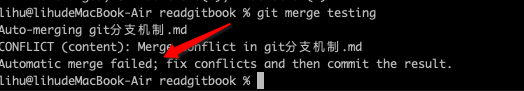
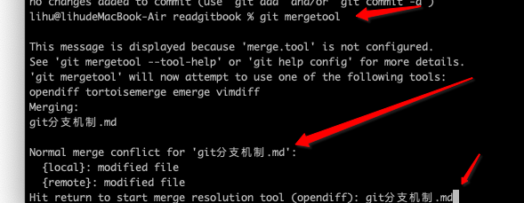
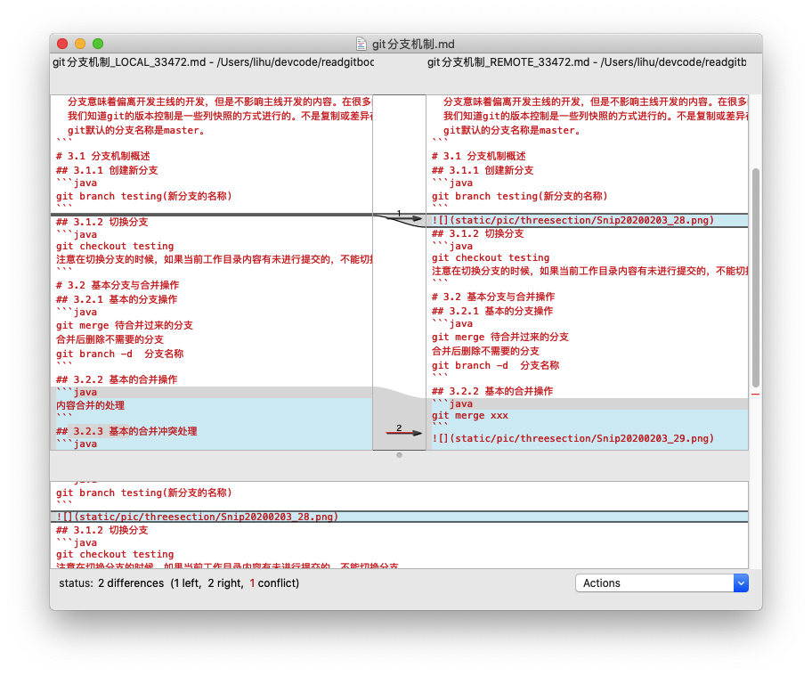
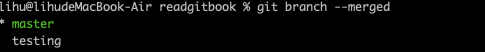
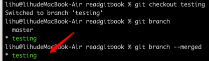

[toc]
```java
  分支意味着偏离开发主线的开发，但是不影响主线开发的内容。在很多的版本控制中，尤其对于一个大型项目来说，控制版本尤其重要。
  我们知道git的版本控制是一些列快照的方式进行的。不是复制或差异存储。
  git默认的分支名称是master。
```
# 3.1 分支机制概述
## 3.1.1 创建新分支
```java
git branch testing(新分支的名称)
```

## 3.1.2 切换分支
```java
git checkout testing
注意在切换分支的时候，如果当前工作目录内容有未进行提交的，不能切换分支
```
# 3.2 基本分支与合并操作
## 3.2.1 基本的分支操作
```java
git merge 待合并过来的分支
合并后删除不需要的分支 
git branch -d  分支名称
```
## 3.2.2 基本的合并操作
```java
git merge xxx
```

## 3.2.3 基本的合并冲突处理
```java
现在有2个分支 testing、master
2个上面都有git分支机制的修改，都提交到暂存了。
现在在master合并testing分支的数据
git merge testing
会发生如下的情况
```






# 3.3 分支管理
```java
查看本地的所有的分支
git branch 
* 表示当前工作分区所在分支【HEAD指向的分支】
查看每个分支上的最新提交
git branch -v
```

```java
查看当前分支的所有已经合并过的分支
git branch --merged
查看当前分支所有未合并过的分支
git branch --no-merged
```



# 3.4 与分支有关的工作流（都是本地操作）
## 3.4.1 长期分支
```java
需要长期维护的分支，比如默认的master分支。
master分支只存放未定班的代码，即已经发布的版本或即将发布的版本的代码。
同时会维护develop或next的平行分支（此类分支不会保证稳定，但是一旦未定后，合并到master分支后，就可以删除此分支）进行开发，只到分支稳定测试后，进行代码的合并到master分支。
```
## 3.4.2 主题分支
```java
和长期分支不同的是，主题分支（topic branch）用于进行短期的，用于实现某一特定功能以及相关工作的分支。比如之前的testing或iss53分支。针对主题分支修改完善稳定后就可以进行删除。
```
# 3.5 远程分支
```java
远程分支是指直线远程仓库的分支的指针。这些指针存在于本地切无法被移动。当你与服务器进行任何网络通信时候，他们会自动更新。远程分支有点像书签，他们会提示你上一次链接服务器时远程仓库中每个分支的位置。
```

