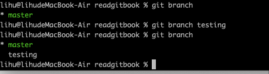

[toc]
```java
  分支意味着偏离开发主线的开发，但是不影响主线开发的内容。在很多的版本控制中，尤其对于一个大型项目来说，控制版本尤其重要。
  我们知道git的版本控制是一些列快照的方式进行的。不是复制或差异存储。
  git默认的分支名称是master。
```
# 3.1 分支机制概述
## 3.1.1 创建新分支
```java
git branch testing(新分支的名称)
```

## 3.1.2 切换分支
```java
git checkout testing
注意在切换分支的时候，如果当前工作目录内容有未进行提交的，不能切换分支
```
# 3.2 基本分支与合并操作
## 3.2.1 基本的分支操作
```java
git merge 待合并过来的分支
合并后删除不需要的分支 
git branch -d  分支名称
```
## 3.2.2 基本的合并操作
```java
git merge xxx
```


## 3.2.3 基本的合并冲突处理
```java
现在有2个分支 testing、master
2个上面都有git分支机制的修改，都提交到暂存了。
现在在master合并testing分支的数据
git merge testing
会发生如下的情况
```


