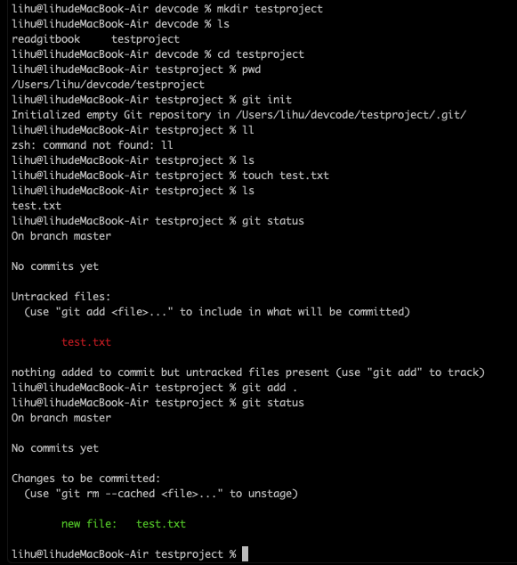
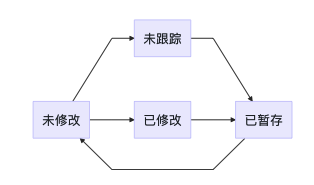
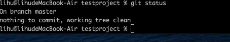
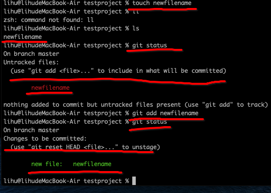
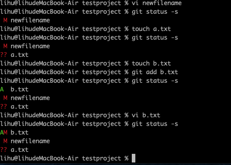
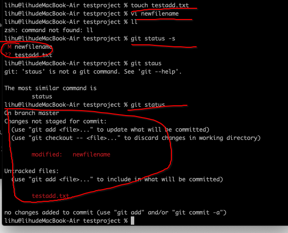

```
在第一篇目中可以学习了解了git的简单命令。
本篇介绍使用git的绝大多数用到的基础命令。
```

# 2.1 获取git仓库

```
获取git仓库的方法有两种。
a、把现有的项目获取目录导入到git中

b、从服务器上克隆现有的git仓库
git clone xxxx
git clone xxxx xxxb
```

## 2.1.1 在现有的项目中初始化git仓库

```
git init
本操作会创建.git子目录。这个子目录包含了构成git仓库骨架的所有必须条件，此时还未跟踪任何文件

进行本工程的内容的跟踪
git add  文件【获取*.文件后缀】
提交
git commit -m 'commits'
```

### 2.1.2 克隆现有的仓库

```
git clone [curl] [newname]
本命令会将所有的服务器上的数据都会进行内容的肤质。
例如
git clone https://github.com/lihu1990/readgitbook.git
git clone https://github.com/lihu1990/readgitbook.git readgitbook
```

# 2.2 git仓库内容的变更

```
在git仓库中的文件存在两类状态
跟踪【tracked】、未跟踪【untracked】
在跟踪状态又分为未修改、已修改、已暂存
```

总体状态图

\

## 2.2.1 查看文件状态

```
git status
```

## 2.2.2 跟踪新的文件

```
git add newfilename
git status
```


## 2.2.3 暂存已经修改的文件

```
git commit -m '提交暂存的文件'
需要注意的是
在修改完一个文件时候，看到的是等待提交到暂存，
这个时候又进行内容的修改看到的状态是待提交和待跟踪需要在此进行git add filename
```


## 2.2.4 查看简洁的git状态信息

```yaml
git status -s
A 表示已经暂存
AM 表示未暂存已修改
?? 表示待跟踪
M 表示已修改
MM 表示已经暂存且已经修改
```

## 2.2.5 忽略文件

```yaml
.gitignore
*.xml
*.log
*.apk
```

# 2.2.6 查看已暂存和未暂存的变更

```yaml
git status
git diff 
git difftool  #可视化进行区别查看

```
# 2.2.7 提交变更
```yaml
git commit
```
