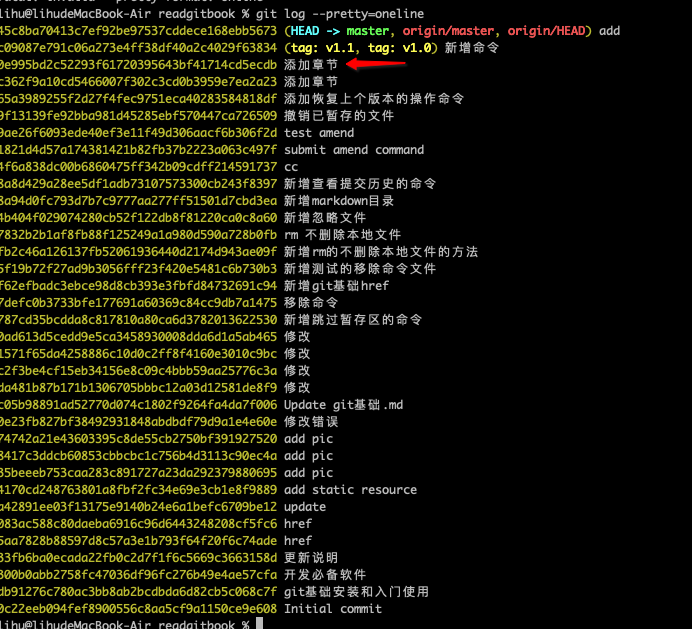
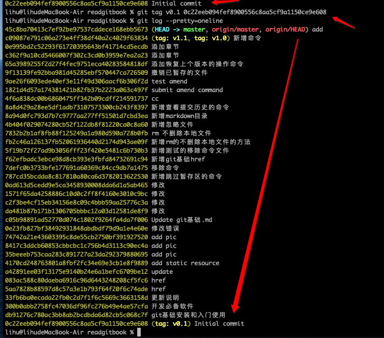

[toc]
```
在第一篇目中可以学习了解了git的简单命令。
本篇介绍使用git的绝大多数用到的基础命令。
```

# 2.1 获取git仓库

```
获取git仓库的方法有两种。
a、把现有的项目获取目录导入到git中

b、从服务器上克隆现有的git仓库
git clone xxxx
git clone xxxx xxxb
```

## 2.1.1 在现有的项目中初始化git仓库

```
git init
本操作会创建.git子目录。这个子目录包含了构成git仓库骨架的所有必须条件，此时还未跟踪任何文件

进行本工程的内容的跟踪
git add  文件【获取*.文件后缀】
提交
git commit -m 'commits'
```

### 2.1.2 克隆现有的仓库

```
git clone [curl] [newname]
本命令会将所有的服务器上的数据都会进行内容的肤质。
例如
git clone https://github.com/lihu1990/readgitbook.git
git clone https://github.com/lihu1990/readgitbook.git readgitbook
```

# 2.2 git仓库内容的变更

```
在git仓库中的文件存在两类状态
跟踪【tracked】、未跟踪【untracked】
在跟踪状态又分为未修改、已修改、已暂存
```

总体状态图

\

## 2.2.1 查看文件状态

```
git status
```

## 2.2.2 跟踪新的文件

```
git add newfilename
git status
```


## 2.2.3 暂存已经修改的文件

```
git commit -m '提交暂存的文件'
需要注意的是
在修改完一个文件时候，看到的是等待提交到暂存，
这个时候又进行内容的修改看到的状态是待提交和待跟踪需要在此进行git add filename
```


## 2.2.4 查看简洁的git状态信息

```yaml
git status -s
A 表示已经暂存
AM 表示未暂存已修改
?? 表示待跟踪
M 表示已修改
MM 表示已经暂存且已经修改
```

## 2.2.5 忽略文件

```yaml
.gitignore
*.xml
*.log
*.apk
```

## 2.2.6 查看已暂存和未暂存的变更

```yaml
git status
git diff 
git difftool  #可视化进行区别查看
```

## 2.2.7 提交变更
```yaml
git commit
```
## 2.2.8 跳过暂存区
```yaml
git commit -a -m "msg"
```
## 2.2.9 移除文件
```yaml
git rm filename
```

```java
在实际的情况中我们希望某个文件不在服务器上进行跟踪(本地文件不删除，push后远程的删除)
git rm --cached filename
```


## 2.2.10 移动文件
```java
git mv fromFileName toFileName
此操作相当于执行如下3条命令
1、mv fromFileName toFileName
2、git rm fromFileName
3、git add toFileName
```
# 2.3查看提交历史
```java
git log
默认不加参数的情况下是针对当前的所有的提交的历史进行的展示(时间倒序)
```


```java
git log -p -2
显示最近2次提交时候的差异内容
```


# 2.4 撤销操作
```java
在提交时候忘记提交或写错了提交的信息，需要重新尝试提交【前提没有进行push上去】，可以使用--amend选项进行修改提交信息
git commit --amend

```

## 2.4.1 撤销已暂存的文件
```java
在实际的版本管理中，在管理工作区和暂存区的时候有时候会
git add *
导致有些文件错误提交到暂存区了，需要进行内容的撤销，如下图：
```

```java
这里我错误的将a.t文件给提交到暂存区了，这个时候我想把a.t文件从暂存区移除，可以参考
git reset HEAD <file>...
因此我们按照提示
git reset HEAD a.t
如下图:
```


## 2.4.2 撤销对文件的修改(危险操作，慎重使用)
```java
在实际的操作中，如果想要恢复到上个版本的状态，这个时候git status 会告诉你
执行git checkout --<file>... 进行恢复到上个版本
```


# 2.5 远程仓库使用
## 2.5.1 显示远程仓库
```java
git remote
该命令会列出每个远程仓库的简短名称。默认origin为克隆源服务器取得默认名称
git remote -v
该命令会显示出git存储的每个远程仓库对应的url
```
## 2.5.2 添加远程仓库
```java
git remote add [shortname] [url]
shortname 是远程仓库的简短名称，url是远程仓库的地址，就可以用shortname代替url获取完整的数据了
```
## 2.5.3 从远程仓库拉取数据
```java
git fetch [remote-name]
remote-name 是远程仓库的名称【或者说是仓库的简短名称】
注意，执行此命令，只会将远程仓库中的数据迁出到本地，但不会合并到本地的工作目录，使用git pull 会尝试自动合并。
git clone命令会自动设置你的本地的master分支，使它跟踪被客户的服务器端的master分支【远程默认分支】。
```
## 2.5.4 将数据推送到远程仓库
```java
git push [remote-name] [branch-name]
将数据推送到远程仓库中。 
remote-name 使远程仓库的简短名称
branch-name 使远程分支名称
默认git push  就是git  push  origin master
```
## 2.5.5 检查远程仓库
```java
git  remote show [remote-name]
git remote show origin
* remote origin
  Fetch URL: https://github.com/lihu1990/readgitbook.git
  Push  URL: https://github.com/lihu1990/readgitbook.git
  HEAD branch: master
  Remote branch:
    master tracked
  Local branch configured for 'git pull':
    master merges with remote master
  Local ref configured for 'git push':
    master pushes to master (up to date)
```
## 2.5.6 删除和重命名远程仓库
```java 
git remote rename oldname  newname
```
# 2.6 标记
## 2.6.1 列举标签
```java
git tag 或
git tag -l 'v1.*'
```
## 2.6.2 创建标签
```java
推荐穿件注释标签[信息更完全]
标签分为2类:注释标签[annotated]、轻量标签[lightweight]
```
## 2.6.3 注释标签
```java
git tag -a v1.4 -m "my version 1.4"
git tag
git show tagname[v1.4] 查看标签数据以及对应的提交信息
```
## 2.6.4 轻量标签
```java
git tag tagname
```
## 2.6.5 补加标签
```java
git  log --pretty=online
查找进行需要打标签的地方 
git tag -a tagname[v1.1] 校验id或部分校验的id
git tag v0.1 0c22eeb094fef8900556c8aa5cf9a1150ce9e608
```


## 2.6.6 共享标签
```java
默认情况下，git push 不会吧标签传输到远程服务器上。因此在创建了标签后，需要明确的将标签推送到共享服务器上。这个过程像推送分支一样
git push origin [tagname]
如果多个tag标签需要一次都推送的话
git push origin --tags
```
## 2.6.7 检出标签
```java
git无法真正的检出一个标签的，因为标签是无法移动的。如果想将某个版本的镜像放入到标签的工作目录中，可以使用
git checkout -b [branchname] [tagname] 在特定的标签上穿件一个新的分支
```
# 2.7 git别名
```java
为了简化git的命令操作
git config --global alias.co checkout
git config --global alias.br branch
git config --global alias.ci commit
git config --global alias.st status
比如移出暂存区
git config --global alias.unstage 'reset HEAD --'
git unstage fileA=git reset HEAD --fileA
显示最后一次提交信息的命令
git config --global alias.last 'log -1 HEAD'
```