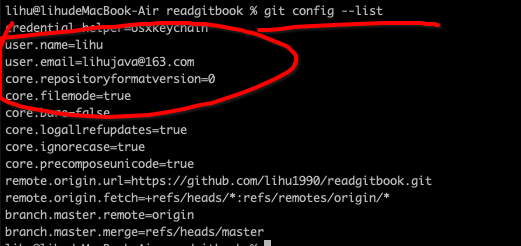

# 1、linux上安装
~~~ yml
fedora上安装
sudo yum install git-all
ubuntu上安装
sudo apt-get install git-all
~~~

## 1.1 git 首次配置
自定义git的环境
只需要在计算机上执行一次即可。

~~~ 
执行的命令
git config 的工具，
用来获取和设置配置变量，
这些变量控制着git外观和
操作的方方面面。可以将配置变量存储在三个不同的位置。
~~~
~~~
a、/etc/gitconfig文件：包含了系统中所有用户以及其仓库的值。如果你向git config传入 --system 选项，那么他就会专门从该文件中读写配置变量。
b、~/.gitconfig或~/.config/git/config文件：针对的是你自己。你可以通过传入--global选项使git专门从该文件中读写配置变量
c、从当前仓库的git目录（也就是.git/config）中的config文件：针对单个仓库。
上面的每一个级别都会覆盖上一个级别中的设置。因此.git/config文件中的值要优于/etc/gitconfig中的值
在windows中的/etc/gitconfig文件是在c:\users\$user下的.gitconfig
~~~

## 1.2 git用户身份
~~~
安装好git后首先设置的是git的用户名和电子邮件地址。
这一步骤很重要，因为git的每一次提交都需要用到这些信息，而且还会被写到到所创建的提交中，不可更新。设置命令如下：
git config --global user.name "lihu"
git config --global user.email "lihujava@163.com"

如上 如果设置传入了--global 选项，那只需要设置一次就行了，之后不管在系统中执行啥操作，git都会使用这个设置好的信息提交。当然在你自己不同的项目中设置name和email可以使用不同的用户名和电子邮件地址。可以在项目中使用不带--global选项的命令。
~~~

## 1.3 设置个人编辑器

~~~ 
设置好身份信息后，就可以配置默认的文本编辑器了。默认git会使用自己配置好的默认编辑器
如果想使用不同的文本编辑器，比如Emacs 可以执行以下命令
git config --global core.editor emacs
在windows中，如果想要使用nodepad++可以执行如下操作
git config --global core.editor "'安装notepad++的安装位置' 追加" 
x86上执行在追加-multiInst -nosession
x64上追加-multiInst
~~~

## 1.4 查看个人的所有的配置
~~~
git config --list
~~~

~~~
git config key[查看某个值得设定]
~~~

